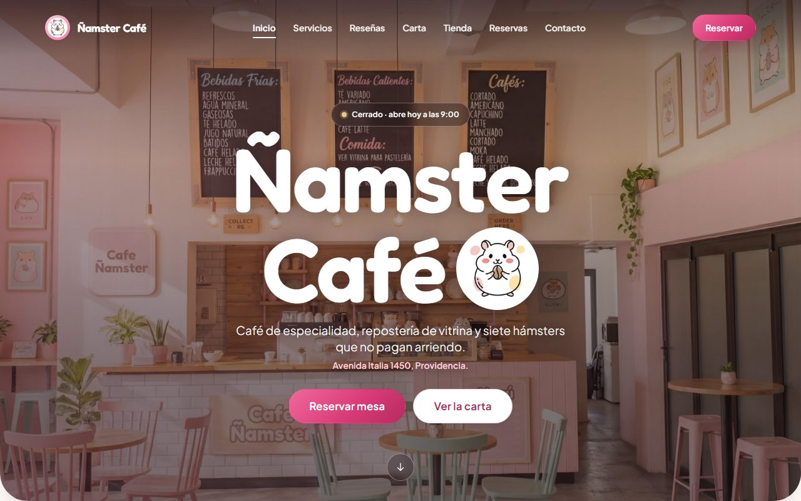
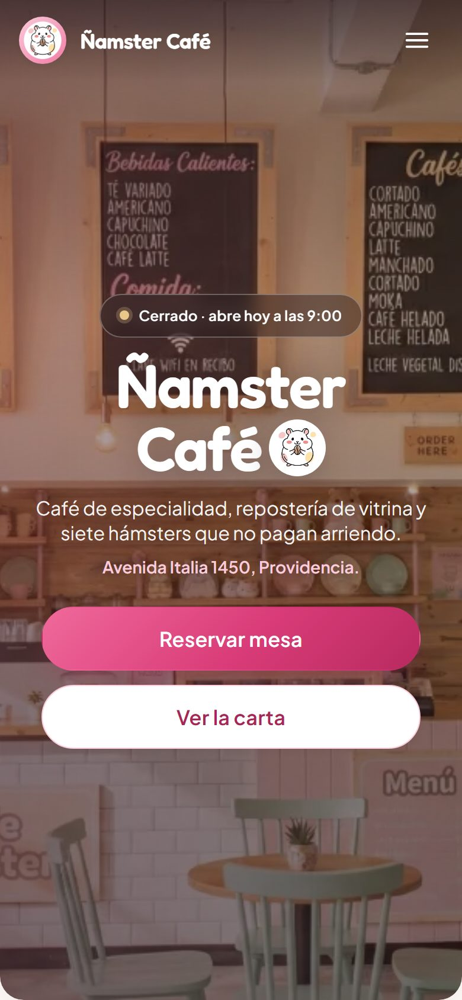

<h1 align="center">Ñamster Café</h1>

<p align="center">
  A neighbourhood coffee shop's site
</p>



<p align="center">
  <a href="https://namster-cafe.nibe.dev/"><strong>View live demo →</strong></a>
</p>

<p align="center">
  
  
  
  
  
</p>

> **Note:** the site's interface and content are in Spanish. This document, the
> code and its comments are in English so the project is easy to review for
> anyone.

---

## What it is

A single-page site for a themed coffee shop in Providencia, Santiago: a menu, a
shop, customer reviews, and a booking form for one of four seating areas.

The interesting part is not the layout. It's the budget it holds itself to — the
whole page weighs **925 KB** after scrolling through everything, on photography
that ships as 37 MB of uncompressed PNG at the source. Every image is negotiated
down to the exact variant the layout needs, and nothing on the page moves while
it loads.

**This is a portfolio project.** The venue, its address, prices and reviews are
fictional. Forms validate and show submission states but there is no backend and
no payment gateway.

## Features

- **Right-sized images** — every image is requested through a Cloudinary
  transformation (`f_auto,q_auto` plus the exact width via `srcset`), so the
  browser negotiates AVIF or WebP and downloads only what it will paint. The hero
  drops from 5,921 KB to 47 KB on a phone.
- **No layout shift** — images publish `width`/`height`, card media reserves its
  box with `aspect-ratio`, and the header height comes from the same token that
  feeds `scroll-padding-top`, so anchored headings always clear the fixed bar.
- **Carousels on native scroll-snap** — touch swiping with momentum, dragging and
  trackpad scrolling all come from the browser; JavaScript only reads the position
  to render the controls.
- **Booking form with real states** — per-field validation, errors that appear on
  blur rather than mid-typing, focus moved to the first invalid field on submit,
  and a confirmation that replaces the form instead of stacking under it.
- **Live opening status** — the hero and the contact section derive "open now" or
  "opens tomorrow at 9:00" from the venue's hours, updated every minute.
- **Deferred third parties** — the Google Maps embed is hundreds of kilobytes of
  JavaScript and cookies in a section many visitors never reach, so a facade with
  the address stands in until it is asked for.
- **Accessibility that was measured, not assumed** — checked against the rendered
  page from 320px to 1920px: no text below the WCAG AA contrast minimum, no touch
  target under 24px, a skip link, `aria-current` on the active nav item, errors
  announced with `role="alert"`, and every decorative animation disabled under
  `prefers-reduced-motion`.



## Stack

| Tool                                          | Role                                             |
| --------------------------------------------- | ------------------------------------------------ |
| **Vue 3** (Composition API, `<script setup>`) | Components and state                             |
| **Vite 8**                                    | Build and dev server                             |
| **Plain CSS3**                                | Design tokens, layout, motion                    |
| **Cloudinary**                                | On-the-fly image transformation and delivery     |
| **ESLint + Prettier**                         | Linting and formatting (flat `eslint.config.js`) |

No Tailwind, no Bootstrap, no component library, no icon font — every piece of
the design is hand-written.

## Architecture

```
src/
├── assets/styles/
│   ├── _tokens.css        Palette, type scale, spacing, shadows, motion
│   ├── _base.css          Reset, global typography, utilities
│   └── _components.css    Buttons, eyebrow, forms
├── components/
│   ├── layout/            AppHeader, AppFooter
│   ├── sections/          One component per page section
│   └── ui/                AppImage, AppCarousel, FormField, cards…
├── composables/
│   ├── useCarousel.js             Paging over scroll-snap
│   ├── useForm.js                 State, validation, submission
│   ├── useOpeningHours.js         Live open/closed state
│   ├── usePrefersReducedMotion.js Shared motion preference
│   ├── useScrollReveal.js         Reveal on entering the viewport
│   └── useScrollSpy.js            Active section in the nav
├── data/                  Content, kept out of the templates
└── lib/cloudinary.js      Transformation URL builder
```

Three decisions worth calling out:

**The carousels do not use `transform`.** The track is a plain `overflow-x: auto`
container with `scroll-snap-type`, which hands swiping, dragging, keyboard
scrolling and RTL behaviour to the browser for free. What JavaScript does own is
the page-step arithmetic in [`useCarousel.js`](src/composables/useCarousel.js),
and it is subtler than it looks: with `n` cards visible the viewport spans `n − 1`
gaps but advancing a page crosses `n` of them, and scroll-snap aligns to the
padding box, so a track at rest reports a non-zero `scrollLeft`. Miss either and
the cards drift out of alignment one page at a time.

**Nothing is styled with a literal value.** Components read colours, spacing,
shadows and easings from `_tokens.css`. That is what made it possible to lift the
brand pink to a shade that clears WCAG AA on the warm canvas by editing one line,
instead of hunting the old value through twenty files.

**Content is separated from presentation.** The menu, the shop, the reviews, the
seating areas and the business details all live in `src/data/`, so changing the
carte or the opening hours never means touching a template. The address, phone
and hours have exactly one definition, read by both the contact section and the
footer.

## Running the project

Requires Node.js `^20.19.0` or `>=22.12.0` (what Vite 8 expects).

```bash
git clone https://github.com/nibeKn/namster-cafe.git
```

```bash
npm install
```

```bash
npm run dev
```

The dev server runs at `http://localhost:5173/`.

| Script            | Purpose                         |
| ----------------- | ------------------------------- |
| `npm run dev`     | Development server              |
| `npm run build`   | Production build into `dist/`   |
| `npm run preview` | Serve the built output          |
| `npm run lint`    | ESLint, zero warnings tolerated |
| `npm run format`  | Prettier across the project     |

`VITE_SITE_URL` in `.env` fills the canonical tag, the Open Graph meta and the
structured data. It holds a public URL, not a secret, which is why it is
committed. `public/robots.txt` and `public/sitemap.xml` are served verbatim by
Vite and carry the URL literally, so update those two alongside it.

## Disclaimer

A personal portfolio project. Non-commercial, and unconnected to any real
business.

- The venue, its address, phone number, prices, menu and customer reviews are
  **fictional**. No payments are processed and no data is collected from anyone:
  the forms validate and simulate a response, then discard what was typed.
- The review portraits come from [Unsplash](https://unsplash.com) under their
  license. The typefaces are Google Fonts.
- If you hold rights to any of this material and would like it removed, please
  open an issue on the repository.

## License

The **source code** is published under the [MIT license](LICENSE): you may use,
modify and redistribute it while keeping the copyright notice and attribution.

---
