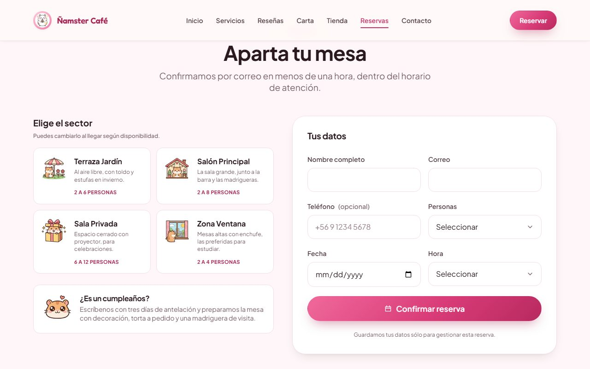

# Ñamster Café

Single-page site for a fictional themed coffee shop in Providencia, Santiago.
Vue 3 with `<script setup>`, Vite, and hand-written CSS — no UI library, no
styling framework.

**Live demo:** https://namster-cafe.vercel.app

> Site copy is in Spanish (es-CL) because that is the venue's language. Code,
> comments and documentation are in English.


## What it does well

**Images.** The source photography is uncompressed PNG of up to 6 MB. Every
image is requested through a Cloudinary transformation (`f_auto,q_auto` plus the
exact width via `srcset`), so the browser negotiates AVIF or WebP and downloads
only what it will paint. Full page weight after scrolling through everything:
**925 KB**, down from ~37 MB. The hero image is preloaded from `<head>` using the
same srcset the component renders, so it is never fetched twice.

**Accessibility.** Verified against the rendered page across widths from 320px to
1920px: no text below the WCAG AA contrast minimum, no touch target under 24px, a
skip link, `aria-current` on the active nav item, form errors announced with
`role="alert"` and wired through `aria-describedby`, and every decorative
animation — carousel auto-rotation included — disabled under
`prefers-reduced-motion`.

**No layout shift.** Images publish `width`/`height`, card media reserves its box
with `aspect-ratio`, and the header height comes from the same token that feeds
`scroll-padding-top`, so anchored headings always clear the fixed bar.

**Real form states.** Validation runs per field, errors appear on blur rather
than mid-typing, submitting an invalid form moves focus to the first offending
field, and the confirmation replaces the form instead of stacking under it.



## Notable decisions

**Carousels use native scroll-snap, not `transform`.** The track is a plain
`overflow-x: auto` container, so the browser supplies touch swiping with
momentum, dragging, trackpad scrolling and correct RTL behaviour. JavaScript only
reads the position to render the controls. See
[`useCarousel.js`](src/composables/useCarousel.js) — the page-step maths there
accounts for the gap count and the scroll-snap origin, both of which are easy to
get subtly wrong.

**No icon library.** Sixteen glyphs do not justify a render-blocking webfont.
[`AppIcon.vue`](src/components/ui/AppIcon.vue) holds the SVG paths and inherits
`currentColor`.

**The Google Maps embed loads on request.** It is hundreds of kilobytes of
third-party JavaScript and cookies, in a section many visitors never reach, so a
facade with the address and a direct Maps link stands in until it is asked for.

**Sector cards are native radio inputs** under a `<label>`, which provides group
semantics, arrow-key roving and "2 of 4 selected" announcements for free.

## Structure

```
src/
├── assets/styles/
│   ├── _tokens.css        Palette, type scale, spacing, shadows, motion
│   ├── _base.css          Reset, global typography, utilities
│   └── _components.css    Buttons, eyebrow, forms
├── components/
│   ├── layout/            AppHeader, AppFooter
│   ├── sections/          One component per page section
│   └── ui/                Reusable pieces (AppImage, AppCarousel, FormField…)
├── composables/
│   ├── useCarousel.js             Paging over scroll-snap
│   ├── useForm.js                 State, validation, submission
│   ├── useOpeningHours.js         Live open/closed state
│   ├── usePrefersReducedMotion.js Shared motion preference
│   ├── useScrollReveal.js         Reveal on entering the viewport
│   └── useScrollSpy.js            Active section in the nav
├── data/                  Content, kept out of the templates
└── lib/cloudinary.js      Transformation URL builder
```

Components never declare literal colours or sizes; everything comes from the
tokens. Content lives in `src/data/`, so editing the menu or the sectors does not
mean touching templates.


## Getting started

```bash
npm install
```

```bash
npm run dev
```

| Script            | Purpose                         |
| ----------------- | ------------------------------- |
| `npm run dev`     | Development server              |
| `npm run build`   | Production build into `dist/`   |
| `npm run preview` | Serve the built output          |
| `npm run lint`    | ESLint, zero warnings tolerated |
| `npm run format`  | Prettier across the project     |

## Deploying

The build output is static, so any static host works. Vite settings are the
defaults: build command `npm run build`, output directory `dist`.

`VITE_SITE_URL` in `.env` fills the canonical tag, the Open Graph meta and the
structured data. It holds a public URL, not a secret, which is why it is
committed. `public/robots.txt` and `public/sitemap.xml` are served verbatim by
Vite and carry the URL literally, so update those two alongside it.

## Known limitations

- Forms validate and show submission states but do not post anywhere. The single
  place to wire a backend is the `onSubmit` handler passed to `useForm`.
- `<input type="date">` renders in the browser's locale, not the document's, so
  the placeholder shows `mm/dd/yyyy` on a US-configured browser.
- `public/docs/menu.pdf` is 4.2 MB for one page and would be worth recompressing.
- The site is a single document. Growing it to several routes would call for Vue
  Router and per-view code splitting.

## Credits

Venue photography and illustrations belong to the project. Review portraits from
[Unsplash](https://unsplash.com). Typefaces
[Fredoka](https://fonts.google.com/specimen/Fredoka) and
[Plus Jakarta Sans](https://fonts.google.com/specimen/Plus+Jakarta+Sans).
